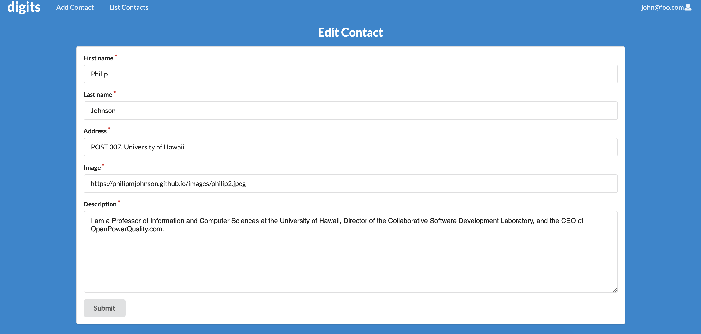

<h1>Digits</h1>

<h3>Installation Instructions:</h3>

<a href="https://www.meteor.com/install">Install meteor</a>

Download <a href="https://github.com/shinsa2/digits">a copy of Digits</a>. You may need to request permission to gain access to the repo.

cd into the app directory and type:

meteor npm install

run the application by typing:

meteor npm run start

The first time running this app will create default users and data.

Ignore any bcrypt warnings for the early stages of development.

The template application will appear at <a href="http://localhost:3000">http://localhost:3000</a>. You can login using the credentials in <a href="http://github.com/ics-software-engineering/meteor-application-template-react/blob/master/config/settings.development.json">settings.development.json</a>

Check for any ESLint errors with

meteor npm run lint

<h3>User Interface Walkthrough</h3>
<h4>Landing Page<h4>

You will see the homepage / landing page that gives you information of the site's features.

<h4>Registration<h4>

Register for an account by clicking "Login" then "Sign Up"

<h4>Sign In<h4>

Click "Login" then "Sign in" to take you to the login page and sign in to your account

<h4>User Home Page</h4>

After logging in, it takes you back to the home page with an updated navbar.

<h4>Add Contact</h4>

The Add Contact page lets you add a new contact.

<h4>List Contacts</h4>

The List Contact page shows a list of all of your contacts.

You can also add a timestamped note at the botton of their contact info.

<h4>Edit Contact</h4>

Clicking on "edit" lets you edit the selected person's contact info.

<h4>Admin User</h4>

It is possible to designate one or more users as “Admins” through the settings file. When a user has the Admin role, they get access to a special NavBar link that retrieves a page listing all Contacts associated with all users.</h4>

